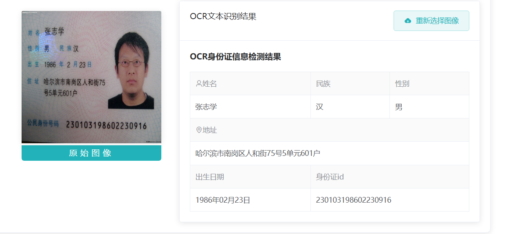
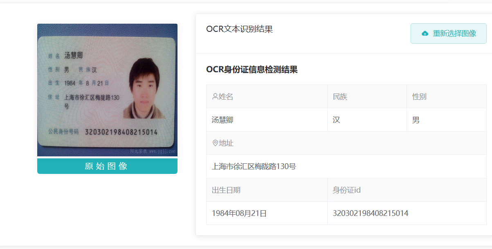

# tansyqinyrproj
数字图像处理项目

# 一、功能列表

1. OCR提取身份证图片文本信息
2. 深度学习车牌识别：上传车辆或车牌图片后识别车牌号，并关联车辆、当前车主和历史记录。
3. 车辆/车主档案：支持车牌找车主、身份证找车辆、车辆车主关系动态变更和历史追溯。
4. 风格迁移：糖果、星空、毕加索、缪斯、马赛克、神奈川冲浪里、达达注意、呐喊、羽毛
5. 基础功能：共39个。
    椒盐噪声、均值平滑、中值平滑、高斯平滑；
    图像锐化-拉普拉斯算子、图像锐化-Sobel算子水平方向、图像锐化-Sobel算子垂直方向、
    将图像用双线性插值法扩大、
    将图像左移30个像素，下移50个像素、
    旋转45度，缩放因子为1、
    转灰度图、转灰度后二值化-全局阈值法、
    直方图均衡化、灰度直方图、
    仿射变换、透视变换、图像翻转、
    RGB转HSV、HSV获取H、HSV获取S、HSV获取V、
    RGB获取B、RGB获取G、RGB获取R、
    水平翻转、垂直翻转、对角镜像、
    图像开运算、图像闭运算、腐蚀、膨胀、
    顶帽运算、底帽运算、
    HoughLinesP实现线条检测、 Canny边缘检测、
    图像增强、
    Roberts算子提取图像边缘、Prewitt算子提取图像边缘、Laplacian算子提取图像边缘、LoG边缘提取。

# 二、技术栈

## 2.1前端开发

- 主要开发语言：HTML,CSS,JavaScript
- 前端框架：Vue.js
- 脚手架：Vue-CLI
- UI：ElementUI
- 代码编辑器：IntelliJ IDEA
- 数据交换：axios
- 前端包管理器：npm
- 前端构建工具：Webpack

## 2.2后端开发

- 主要开发语言:Python
- 后端框架：Flask
- 代码编辑器：IntelliJ IDEA
- 版本控制系统：Git
- 跨域工具：flask-cors
- OCR：pytesseract / Tesseract
- 车牌识别：hyperlpr3 / onnxruntime
- 数据库：SQLite

# 三、项目运行

## 3.1 安装依赖

Python 依赖：

```Bash
pip install -r requirements.txt
```

1. 首先本地需要安装tesseract，项目使用tesseractV4.0版本，使用 `tesseract-ocr-setup-4.00.00dev.exe` 安装包于本地安装。
    1. ```Plain
        PS D:\xxx> tesseract -v
        tesseract 4.00.00alpha
        ...
        ```
2. tesseract语言包下载。
    1.  下载 [chi_sim.traineddata](https://tesseract-ocr.github.io/tessdoc/Data-Files.html)。 在 `/安装路径/Tesseract-OCR/tessdata`路径下保存 `chi_sim.traineddata` 文件。

## 3.2 修改配置

`config.py` 文件中修改配置信息，尤其是本机 Tesseract 路径和 `TESSDATA_PREFIX`。

车牌识别模型已经提交到：

```Plain
models/.hyperlpr3/20230229/onnx/
```

车辆/车主 SQLite 数据库位于：

```Plain
data/vehicle_owner.db
```

启动后端时会自动执行数据库初始化。如果需要恢复种子数据，可在项目根目录运行：

```Bash
python -c print(__import__('core.vehicle_db',fromlist=['x']).reset_database())
```

## 3.3 前端操作

首先在terminal中进入firstend文件夹，依次输入以下命令启动。

```Bash
# install dependency
npm install
# develop
npm run dev
```

若启动失败，尝试删除 `node_modules` 文件夹和 `package-lock.json`文件重新执行上述步骤。 如果仍然失败：尝试降低本地node.js版本，我用的是 `v12.17.0`。

## 3.4 后端操作

Pycharm 或其他idea中 run `app.py`，也可以在项目根目录运行：

```Bash
python app.py
```

访问：

```Plain
http://127.0.0.1:5000/
```

## 3.5 测试

```Bash
python test_plate_vehicle.py
python test_vehicle_api.py
python test_all_features.py
```

`test_all_features.py` 会测试主要页面、基础图像处理、风格迁移、身份证 OCR、车牌识别、车辆档案查询和关系变更。

# 四、功能展示

基础功能略多，在项目文档中有图片展示。

## 4.1 OCR提取身份证图片文本信息





## 4.2 车牌识别和车辆档案

- 车牌识别页面：`/plate/recognize`
- 车牌找车主：`/vehicle/search`
- 身份证找车辆：`/owner/search`
- 关系动态变更：`/relations`

可用测试数据：

- 车牌图片：`uploads/plate_test.png`
- 车牌号：`粤Z5A55港`、`苏BD0011`、`京A88888`
- 身份证号：`44030119840217411X`、`110103198211290041`、`43062419900818361X`

当前种子数据库规模：

- 车主：12 条
- 车辆：14 条
- 关系历史：20 条
- 当前有效车辆关系：14 条


## 风格迁移：

### 糖果


### 星空


### 毕加索


### 缪斯


### 马赛克


### 神奈川冲浪里


### 达达主义


### 呐喊


### 羽毛


